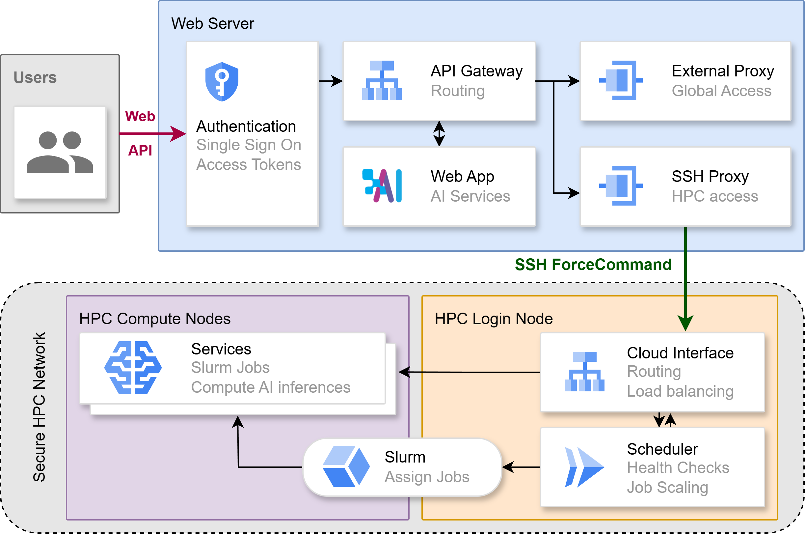

<h1 align="center">
SAIA - the Scalable AI Accelerator - Hub
</h1>
<p align="center">
<a href="https://docs.hpc.gwdg.de/services/saia"><b>Documentation</b></a> | <a href="https://arxiv.org/abs/2407.00110"><b>Paper</b></a>
</p>

This repository contains the server components of the Scalable AI Accelerator SAIA, which hosts AI services such as <a href="https://chat-ai.academiccloud.de">Chat AI</a>. The implementation of the remaining components of the complete architecture for Chat AI can be found in two other repos:
- Stand-alone web interface: https://github.com/gwdg/chat-ai
- HPC-side components, incl. scheduler and slurm scripts: https://github.com/gwdg/saia-hpc

<p align="center">

</p>

Together these repos provide the entire underyling mechanism for Chat AI, which can be generalized as a slurm-native HPC web service.

## SAIA Hub

SAIA is the umbrella brand that hosts our AI services. It consists of an API gateway which performs routing and user management, and several proxies that connect to various backend services such as an HPC center or external cloud service, in order to route incoming requests to these upstream connections. All components can be deployed as docker containers; the configuration is provided in the `docker-compose.yml` file.

### API Gateway
The API Gateway, Kong OSS, is the entrypoint of incoming requests. Since it doesn't support OAuth integration out-of-the-box, we run Apache with a module named `OpenIDC` only for the purpose of integration with our OAuth provider <a href="https://academiccloud.de">AcademicCloud</a>'s Single-Sign-On (SSO); all requests are then routed directly to Kong. Kong can perform user management, load balancing, health checks, offering API keys or tokens for direct access to certain routes, and also integrates with monitoring services such as Prometheus. 

### SSH-based proxy

In a typical HPC cluster setting, the high-performance compute nodes that are capable of running Large Language Models (LLMs) may not be directly accessible from the internet. In these circumstances, the requests from the web server would have to go through an entry point to the cluster, for example a login node or service node. Furthermore, direct tunneling and port forwarding may be forbidden as a security mechanism, and only certain protocols such as SSH may be allowed.

Therefore, the HPC proxy runs on the cloud server and uses an SSH key to establish a connection to the cluster's entrypoint, i.e. the login/service node. For security reasons, the SSH key hosted on the cloud server is restricted to always run a single script on the login node, namely `cloud_interface.sh` and is never actually given a shell instance. This prevents direct access to the cluster even if the web server is compromised. The restriction to run this script is implemented by configuring the ForceCommand directive in SSH for this specific SSH key; this can be set in the `~/.ssh/authorized_keys` file of an HPC user or functional account without root access.

<!-- For every user request on the frontend, Apache gets a unique "Inference ID" from the mediator app, which then stores it in a dictionary, and is passed on to the frontend instead of user info. When the frontend app wishes to communicate with the backend via the mediator, it must include an active "Inference ID" which it received from the initial request. Therefore, the frontend doesn't know any details of the user, but the mediator can find this information by looking up the "Inference ID" in its dictionary, which is then used for monitoring and accounting purposes. -->

### External proxy
Alternatively, some services may be hosted on the internet by other service providers such as OpenAI or Microsoft. To maintain full control over the communications to these service providers, it is vital to send and receive such requests from the web server. The API gateway treats this external proxy as an upstream server, which then indirectly forwards incoming requests to the service providers.

## Getting started

Make sure you have docker installed.

```bash
docker --version
```

Clone this repository and navigate to the root folder.

```bash
git clone https://github.com/gwdg/saia-hub
cd saia-hub
```

Create the `secrets/POSTGRES_PASSWORD` file and set the database password in it.

Start the database and Kong API gateway:
```bash
docker compose up db -d
docker compose up kong-migrations
docker compose up kong -d
```

You should now be able to access the Kong dashboard via `localhost:8002`, the database via `localhost:8001` and the admin API via `localhost:8000`, or whatever port number is defined in `docker-compose.yml`.

### SSH-based proxies
Configure the SSH-based proxy settings. Create a `docker-compose.env` file and set the environment variables following this template:
```
PORT=8721
HPC_HOST=hpc.example.com
HPC_USER=user
KEY_NAME=my-ssh-key
```

Create the SSH key on the cloud server, and add a restricted entry via ForceCommand in the `authorized_keys` file in the HPC cluster following this template:

```bash
command="/path/to/cloud_interface.sh" ssh-rsa <public_key>
``` 

Configure the secrets and environment variables accordingly in order to establish the connections to the upstream HPC services. 
Then, start the proxy:
```bash
docker compose --env-file docker-compose.env build proxy-kisski
docker compose --env-file docker-compose.env up proxy-kisski
```

It is possible to define multiple proxies in the `docker-compose.yml` file. Specific routes can be configured to each proxy in Kong.

### External proxies
The azure proxy enables access to OpenAI models hosted through Microsoft Azur. To run this proxy, set the secrets as specified in the `docker-compose.yml` file according to the provided information. Then, start the proxy:
```bash
docker compose build proxy-azure
docker compose up proxy-azure
```

## Database backup and restore

The two scripts `tools/db_backup.sh` and `tools/db_restore.sh` provide the possibility to store and restore backups of the database, which contains all routes, services, consumer/users and other configurations that are used in Kong.

## Acknowledgements

We thank all colleagues and partners involved in this project.

## Citation

If you use SAIA or Chat AI in your research or services, please cite us as follows:

```
@misc{doosthosseini2024chataiseamlessslurmnative,
      title={Chat AI: A Seamless Slurm-Native Solution for HPC-Based Services}, 
      author={Ali Doosthosseini and Jonathan Decker and Hendrik Nolte and Julian M. Kunkel},
      year={2024},
      eprint={2407.00110},
      archivePrefix={arXiv},
      primaryClass={cs.DC},
      url={https://arxiv.org/abs/2407.00110}, 
}
```